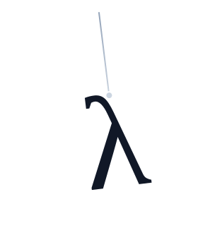

<p align="center">
  
</p>

<h1 align="center">Rain</h1>

<p align="center"><strong>C++23 异步运行时</strong></p>

<p align="center">每核事件循环 · 协程任务 · epoll reactor · 层次时间轮 · ThreadPool · spawn_blocking bridge</p>

<p align="center">
  
  
  
  
    <a href="https://linux.do" alt="LINUX DO"></a>
</p>

<p align="center">
  <a href="README_EN.md">English</a> ·
  <a href="#快速开始">快速开始</a> ·
  <a href="#构建">构建</a> ·
  <a href="#benchmark">Benchmark</a> ·
  <a href="LICENSE">MIT License</a>
</p>

Rain 是一个面向 Linux 的 C++23 异步运行时，核心由每核事件循环、协程任务、epoll reactor、层次时间轮、线程池和同步-异步桥接组成。

| 方向 | 内容 |
| --- | --- |
| 执行模型 | per-core shared-nothing |
| 核心抽象 | `Result<T, E>`、`Task<T>`、`EventLoop` |
| 阻塞桥接 | `ThreadPool + eventfd + spawn_blocking()` |
| 网络层 | `TcpListener`、`TcpStream`、I/O awaiters |

## Benchmark

TCP echo，`wrk -t4 -c256 -d15s`，双方均为 Release，测试机为 Ryzen 5 5600H（6C/12T）：

| 指标 | Rain | Tokio |
| --- | ---: | ---: |
| Requests/sec | 247,283 | 219,543 |
| Avg Latency | 788 us | 819 us |
| Max Latency | 9.31 ms | 18.45 ms |
| Stdev | 282 us | 477 us |
| Timeouts | 0 | 0 |

运行方式：

```bash
cd rain
cmake -B build -DRAIN_BUILD_BENCHMARKS=ON
cmake --build build
bash benchmark/run_bench.sh
```

### 为什么比 Tokio 还要快？
难道老王是天才吗？很遗憾，并不是。

Rain 之所以能在这组测试里超过 Tokio，主要原因是它没有采用任务窃取。因此，可以减少任务在不同 CPU 核之间传递带来的额外开销。

这是否意味着 Rain 没有应用层自动负载均衡策略？是的。Rain 没有设计应用层自动负载均衡，而是把负载均衡更多交给内核层处理。

对于网络任务，使用 `SO_REUSEPORT` 后，内核可以自动把连接分配到不同的 CPU 核上，从而达到负载均衡的效果，也因此减少了自动跨核传递任务的成本。

这是否意味着 Rain 完全没有跨核任务传递能力？也不是。我们仍然可以通过 `EventLoop::submit()` 显式地把任务投递到指定核心，在需要时完成跨核传递。

## 架构

```text
src/
├── core/       类型别名、Result<T, E>、概念约束
├── sync/       Channel、SpinLock
├── async/      Task、EventLoop、EpollReactor、时间轮、信号、组合子
├── runtime/    Runtime、Executor、ThreadPool、spawn_blocking 桥接
└── net/        TcpListener、TcpStream、地址、I/O awaiter
```

层级依赖严格自上而下：

```text
Layer 0  core/       基础：类型别名、Result、概念
Layer 1  sync/       同步原语：Channel、SpinLock
Layer 2  async/      运行时核心：Task、EventLoop、epoll、定时器、信号
Layer 3  runtime/    编排：Runtime、Executor、ThreadPool、Bridge
Layer 4  net/        网络：TCP 监听器、流与 I/O awaiter
```

## 快速开始

```cpp
#include "async/event_loop.hpp"
#include "async/task.hpp"
#include "core/types.hpp"
#include "net/address.hpp"
#include "net/tcp_listener.hpp"
#include "net/tcp_stream.hpp"
#include "runtime/runtime.hpp"

#include <array>
#include <memory>

using namespace rain;

namespace {

static constexpr char kResponse[] = "HTTP/1.1 200 OK\r\n"
                                    "Content-Type: text/plain; charset=utf-8\r\n"
                                    "Content-Length: 13\r\n"
                                    "Connection: keep-alive\r\n"
                                    "\r\n"
                                    "Hello, World!";

[[nodiscard]] auto handle_conn(net::TcpStream stream) -> async::Task<Unit>
{
    std::array<u8, 128> buf{};

    while (true) {
        auto n = co_await stream.read(buf.data(), buf.size());
        if (!n || *n == 0) {
            co_return unit;
        }

        auto w = co_await stream.write_all(
            reinterpret_cast<const u8*>(kResponse), sizeof(kResponse) - 1);
        if (!w) {
            co_return unit;
        }
    }
}

[[nodiscard]] auto accept_loop(Shared<net::TcpListener> listener) -> async::Task<Unit>
{
    while (true) {
        auto accepted = co_await listener->accept();
        if (!accepted) {
            continue;
        }

        auto [stream, _] = std::move(*accepted);
        runtime::spawn(handle_conn(std::move(stream)));
    }

    co_return unit;
}

} // namespace

auto main() -> int
{
    auto rt = runtime::Runtime::builder()
        .worker_threads(4)
        .enable_blocking(false)
        .build();
    if (!rt) {
        return 1;
    }

    auto run_result = rt->run([](async::EventLoop& loop, usize) -> Result<Unit> {
        auto listener = net::TcpListener::bind(loop.reactor(), net::SocketAddress::any(9000));
        if (!listener) {
            return Err(std::move(listener).error());
        }

        auto shared = std::make_shared<net::TcpListener>(std::move(*listener));
        loop.spawn(accept_loop(shared));
        return Ok();
    });

    if (!run_result) {
        return 1;
    }

    rt->join();
    return 0;
}
```

## 构建

```bash
cd rain
cmake -B build
cmake --build build
```

启用 benchmark：

```bash
cd rain
cmake -B build -DRAIN_BUILD_BENCHMARKS=ON
cmake --build build
```

## 环境要求

- C++23（GCC 13+ 或 Clang 17+）
- Linux（`epoll`、`eventfd`、`signalfd`）
- CMake 3.28+

## 核心设计

- 每核无共享：每个核心运行独立的 `EventLoop`、reactor 和 timer，热路径不共享状态。
- `Result<T, E>` 贯穿全局：不依赖异常作为控制流，错误统一显式传播。
- 惰性协程 + 对称转移：`Task<T>` 创建即挂起，`final_suspend` 通过 continuation 做零额外栈增长的协程切换。
- 层次时间轮：4 层结构，插入和取消保持 O(1) 级别。
- `spawn_blocking`：通过 `ThreadPool + eventfd` 把阻塞任务卸载出去，再唤醒原事件循环继续执行。
- 跨核任务提交：`EventLoop::submit()` 支持显式把任务投递到指定核心。

## 组件一览

| 组件 | 文件 | 作用 |
| --- | --- | --- |
| `Task<T>` | `src/async/task.hpp` | 惰性协程、对称转移、协作式取消 |
| `EventLoop` | `src/async/event_loop.hpp` | 每核调度器：ready queue + epoll + timer + submit |
| `EpollReactor` | `src/async/io_reactor.hpp` | epoll 封装与 I/O awaiter 支撑 |
| `HierarchicalTimerWheel` | `src/async/timer.hpp` | 层次时间轮 |
| `Executor` | `src/runtime/executor.hpp` | 多核 EventLoop 编排 |
| `ThreadPool` | `src/runtime/thread_pool.hpp` | 阻塞任务线程池 |
| `Bridge` | `src/runtime/bridge.hpp` | `spawn_blocking()` 的同步-异步桥接 |
| `Runtime` | `src/runtime/runtime.hpp` | 统一运行时入口 |
| `TcpListener` | `src/net/tcp_listener.hpp` | 异步 accept |
| `TcpStream` | `src/net/tcp_stream.hpp` | 异步读写与 sendfile |

## 许可证

Rain 使用 [MIT License](LICENSE)。

## 鸣谢与参考

### 项目

- [Nginx](https://github.com/nginx/nginx)：每 worker 无共享模型与 `SO_REUSEPORT` 使用方式的重要参考。
- [Tokio](https://github.com/tokio-rs/tokio)：per-core runtime、`spawn_blocking`、时间轮等设计参考来源。
- [libuv](https://github.com/libuv/libuv)：事件循环与 reactor 模型参考。
- [zedio](https://github.com/8sileus/zedio)：现代 C++ 异步运行时设计参考。
- [TinyWebServer](https://github.com/qinguoyi/TinyWebServer)：Linux 网络编程与 epoll 实践参考。
- [Linux kernel](https://kernel.org)：层次时间轮算法参考来源。

### 论文

- [Hashed and Hierarchical Timing Wheels](http://www.cs.columbia.edu/~nahum/w6998/papers/ton97-timing-wheels.pdf)：时间轮设计的经典论文。

### 书籍

- 《Unix 编程艺术》
- 《Linux 高性能服务器编程》
- 《C++ 函数式编程》
